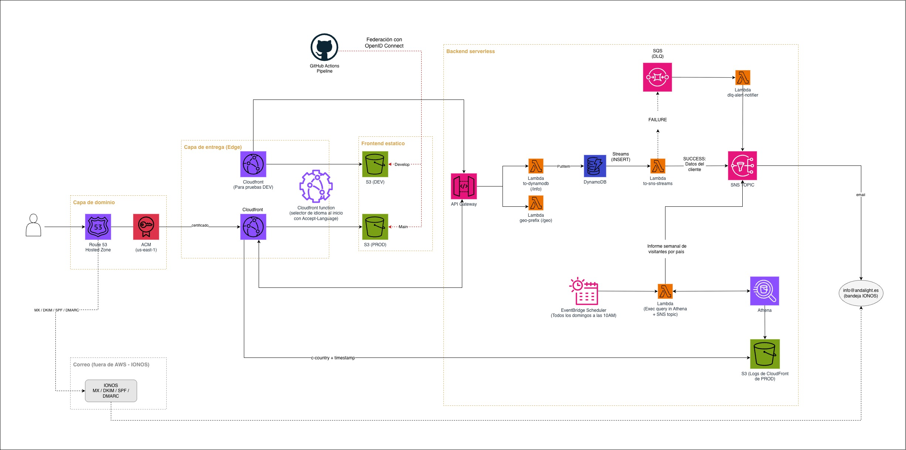

# Andalight — Arquitectura AWS (Capstone)

Web estática de turismo de lujo (`andalight.es`): frontend **Astro** en S3 + CloudFront y un
**backend serverless** para el formulario de contacto y la analítica de visitantes. Todo montado
**a mano por consola** (sin IaC). Región **eu-west-1**, salvo ACM en **us-east-1** (requisito de
CloudFront).

## Stack

| Capa | Componentes |
|---|---|
| Frontend | Astro (build *directory*), multipágina, i18n `es`/`en`/`fr` |
| Entrega | CloudFront (OAC) → S3 privado · CF Function en viewer-request · 2 distribuciones: **PROD** (`main`) / **DEV** (`develop`, con WAF free) |
| API | API Gateway **HTTP** como 2º origen de CloudFront (`/info`, `/geo`) → **same-origin, sin CORS** |
| Datos | DynamoDB `andalight-requests-db` (PK `id`, on-demand, sin TTL) + Streams |
| Notificación | SNS (topic **único**) → email a `info@andalight.es` (IONOS) |
| Analítica | EventBridge Scheduler → Lambda → Athena/Glue sobre logs CloudFront (parquet) |
| CI/CD | GitHub Actions + **OIDC**; push a branch → sync a S3 + invalidación de su CloudFront |
| Correo | Fuera de AWS: MX/SPF/DKIM/DMARC en IONOS (sin SES) |

## Flujos

**Web + i18n.** `Route 53 → CloudFront → CF Function → S3 (OAC)`. La CF Function: deja pasar
`/info` y `/geo`; `www`→apex (301); en `/` elige idioma por **`Accept-Language`** y redirige a
`/<lang>/` (302, `vary: accept-language`); canonicaliza barra final (301); reescribe a `index.html`
(el build *directory* de Astro en S3+OAC no autocompleta índices).

**Lead.** `POST /info → API GW → Lambda to-dynamodb → PutItem → DynamoDB`. El **Stream (INSERT)**
dispara `dynamodb-to-sns-streams`, que publica en SNS → email. Si SNS falla, marca el item
(`status=error-notificacion`) y relanza; tras los reintentos, el registro va a la **SQS DLQ**
(`OnFailure` del event source mapping), y `dlq-alert-notifier` manda **un** aviso.

**`/geo`.** El frontend, en la página de contacto, llama a `/geo`; `geo-prefix` devuelve el
prefijo telefónico según **`CloudFront-Viewer-Country`**. Independiente del idioma (idioma =
navegador, país = geo edge).

**Informe semanal.** EventBridge Scheduler (**dom 10:00 UTC+02:00**) → Lambda lanza query en
Athena (tabla Glue, **partition projection**) sobre los logs de CloudFront → resultados en
`athena-results/` del mismo bucket → informe de visitantes por país vía SNS. Logs con **lifecycle
90 días**.

## Decisiones clave

| Decisión | Por qué / trade-off |
|---|---|
| S3 privado + **OAC** (no website público) | Bucket nunca público; todo pasa por CloudFront. Obliga a reescribir `index.html`. |
| i18n en el **edge** por `Accept-Language` | Instantáneo y respeta el navegador. `/` no cacheable (`no-store`). |
| API **same-origin** en CloudFront | El navegador no dispara preflight (cero CORS de cara al cliente); la Lambda acopla la API a la distribución. |
| DynamoDB **on-demand**, PK simple, sin TTL | Volumen bajo y esporádico; leads se conservan. Crecimiento ilimitado. |
| Notificación **desacoplada** (Streams + DLQ) | `/info` responde aunque SNS falle; aviso de error único desde la DLQ. |
| **Un** SNS Topic | Mismo objetivo (email a IONOS). Sin filtrado por tipo. |
| Logs **parquet v2** + partition projection | Sin crawler ni ETL; menos escaneo → menos coste. |

## Limitaciones / futuro

- Sin IaC → migrar a Terraform/CDK.

## Deploy.yml

- Se adjunta también el archivo .yml desde la que se publica la web estática y sus reglas

## Notas adicionales

- Por privacidad, se ha decidido mantener el repositorio privado, ya que se trata de un proyecto real. Se ha optado por compartir las decisiones de arquitectura más importantes y una demostración del correcto funcionamiento.

## Vídeos

<video controls src="Grabacion arquitectura.mov" title="Arquitectura"></video>

<video controls src="Grabacion consola.mov" title="Consola"></video>

<video controls src="Grabacion web.mov" title="Web"></video>
